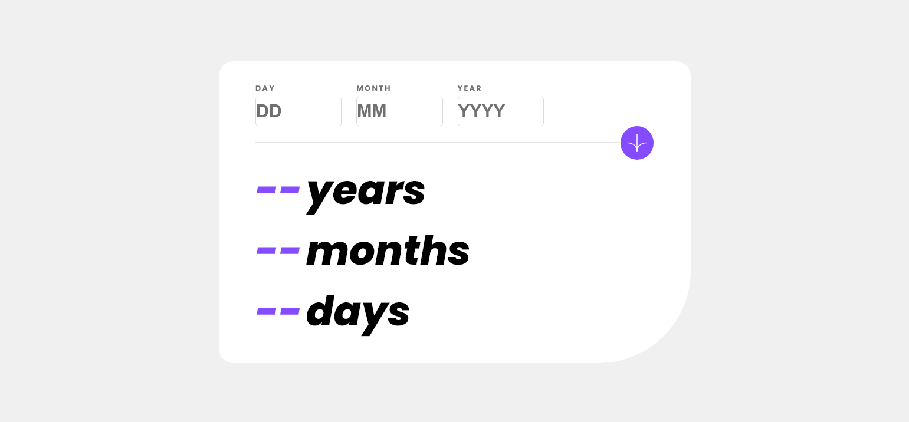

# Frontend Mentor - Age calculator app solution

This is my solution to the [Age calculator app challenge on Frontend Mentor](https://www.frontendmentor.io/challenges/age-calculator-app-dF9DFFpj-Q).

## Table of contents

- [Overview](#overview)
  - [The challenge](#the-challenge)
  - [Screenshot](#screenshot)
  - [Links](#links)
- [My process](#my-process)
  - [Built with](#built-with)
  - [What I learned](#what-i-learned)
  - [Continued development](#continued-development)
  - [Useful resources](#useful-resources)
- [Author](#author)

## Overview

### The challenge

Users should be able to:

- View an age in years, months, and days after submitting a valid date through the form
- Receive validation errors if:
  - Any field is empty when the form is submitted
  - The day number is not between 1-31
  - The month number is not between 1-12
  - The year is in the future
  - The date is invalid e.g. 31/04/1991 (there are 30 days in April)
- ~~View the optimal layout for the interface depending on their device's screen size~~(Didn't have time for it..)
- ~~See hover and focus states for all interactive elements on the page~~(Had an issue, couldn't figure it out..)
- **Bonus**: See the age numbers animate to their final number when the form is submitted

### Screenshot

### Links

- Solution URL: [Github repo](https://github.com/G-Jasser/Frontend-Mentor-Challenges/tree/main/age-calculator-app-main)
- Live Site URL: [Live demo](https://age-calculator-silk.vercel.app)

## My process

### Built with

- CSS custom properties
- CSS Grid, Flexbox
- VueJS

### What I learned

I initially aimed to complete this challenge within 5 hours. However, I ended up quadrupling that timeframe. This taught me to account for unexpected difficulties and delays by setting up my deadline x3~4 the initially-planned one.

Since this was my first time using VueJS, I encountered challenges in deciding whether to utilize the Composition API or the Options API. After some thought, I decided to work with the Options API for this project as it had a clearer structure and it felt easier to get started with.

Overall, I am starting to grasp VueJS, and I feel increasingly confident in my ability to work with this framework

### Continued development

For my future projects, I plan to keep practicing with VueJS and to try using the Composition API instead of the Options API.
Additionally, I must admit that I don't have a thorough understanding of Single File Components (SFC) and Vue Components yet, so I also plan to dedicate my next project to learning and applying these concepts.

### Useful resources

- [VueJS.org](https://vuejs.org/) - This helped me a lot. It had everything I needed (checkout [/tutorial](https://vuejs.org/tutorial), [/examples](https://vuejs.org/examples), or [/guide](https://vuejs.org/guide) ), although navigating through it can be a cognitive overload.
- [Intro to Vue 3](https://www.vuemastery.com/courses/intro-to-vue-3/intro-to-vue3) - This is an awesome free course on Vue Mastery.
- [Vue JS 3 Tutorial for Beginners](https://youtu.be/YrxBCBibVo0) - Very cool YouTube vidoes by The Net Ninja, helped me understand VueJS. 
These are my recommendations for anyone who wants to start learning this framework.

## Author

- Frontend Mentor - [@G-Jasser](https://www.frontendmentor.io/profile/G-Jasser)
